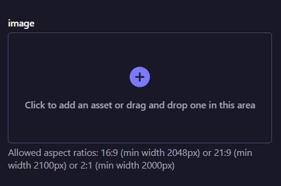
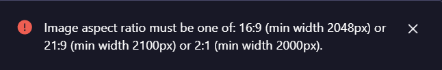
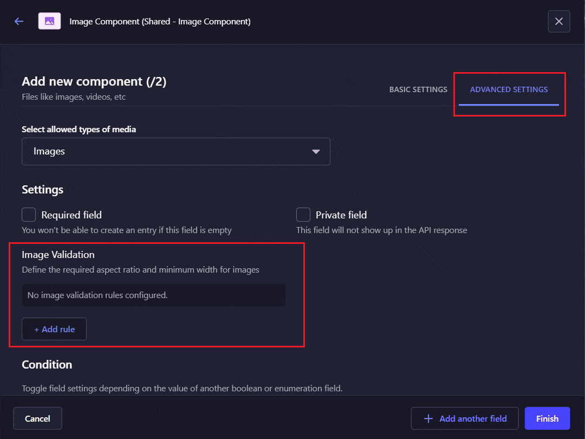

# Strapi Image Validation

A Strapi plugin that validates images uploaded through Media fields based on **aspect ratio** and **minimum width**.

Configure image requirements directly in the Strapi Admin Panel and help content editors select images that meet the requirements of your website.

<!-- Screenshot of the Image Validation configuration in Strapi Admin Panel -->



When an invalid image is selected, a validation error is displayed as shown below:



## What is it?

Different sections of a website often require images with specific proportions and resolutions.

For example:

- Hero banner → `16:9`, minimum width `2048px`
- Content card → `4:3`, minimum width `1600px`
- Square promotional image → `1:1`, minimum width `1200px`

Strapi Image Validation allows developers to configure these requirements directly on individual Media fields.

Validation of image dimensions and resolution on the Strapi level prevents:

- Website layout breaking
- Poor-quality images on the website
- Images not fitting well on the website
- Images getting clipped excessively

## Features

- Validate images in Strapi Media fields.
- Configure validation rules independently for each Media field from Strapi Content-Type builder.
- Validate image aspect ratios.
- Define a minimum image width.
- Support multiple acceptable aspect ratio and width combinations.
- Allow different Media fields to have different image requirements.
- Configure validation directly from the Strapi Content-Type Builder.
- Support higher-resolution images without requiring exact image dimensions.
- Provide validation feedback when an image does not meet the configured requirements.

## Compatibility

| Requirement | Supported Version |
| ----------- | ----------------- |
| Strapi      | `5.0.0 and up`    |
| Node.js     | `18.x and up`     |

The plugin is built for **Strapi v5**.

## Installation

Install the plugin in your Strapi project:

```bash
npm install strapi-plugin-image-validation
```

After installation, rebuild the Strapi Admin Panel:

```bash
npm run build
```

Then start Strapi:

```bash
npm run develop
```

## Configuration

Image validation is configured independently for each Media field.

Navigate to:

```text
Content-Type Builder
    → Select a Content Type
        → Select a Media Field
            → Advanced Settings
                → Image Validation
```

<!-- Screenshot of the configuration section here -->



### Basic Configuration

Each validation rule contains:

| Setting       | Description                                     |
| ------------- | ----------------------------------------------- |
| Aspect Ratio  | The required width-to-height ratio of the image |
| Minimum Width | The minimum width of the image in pixels        |

For example:

```text
Aspect Ratio: 16:9
Minimum Width: 2048px
```

This means the image must have a `16:9` aspect ratio and a width of at least `2048px`.

### Configuration Example

The validation configuration is stored as part of the Media field configuration.

```json
{
  "imageValidation": {
    "rules": [
      {
        "aspectRatio": {
          "width": 16,
          "height": 9
        },
        "minWidth": 2048
      }
    ]
  }
}
```

The configuration above requires:

```text
Aspect Ratio: 16:9
Minimum Width: 2048px
```

### Multiple Validation Rules

A Media field can support multiple valid image formats.

For example:

```json
{
  "imageValidation": {
    "rules": [
      {
        "aspectRatio": {
          "width": 16,
          "height": 9
        },
        "minWidth": 2048
      },
      {
        "aspectRatio": {
          "width": 4,
          "height": 3
        },
        "minWidth": 1600
      },
      {
        "aspectRatio": {
          "width": 1,
          "height": 1
        },
        "minWidth": 1200
      }
    ]
  }
}
```

In this example, the Media field accepts an image when it satisfies **at least one** of the configured rules.

The validation logic is:

```text
Rule 1
   OR
Rule 2
   OR
Rule 3
```

Each individual rule requires both conditions to be satisfied:

```text
Aspect Ratio
      AND
Minimum Width
```

For example:

```text
16:9 + minimum width 2048px
```

is one complete validation rule.

### Minimum Width Is Rule-Specific

The minimum width is configured independently for each aspect ratio.

For example:

```text
16:9 → Minimum Width: 2048px
4:3  → Minimum Width: 1600px
1:1  → Minimum Width: 1200px
```

An image only needs to satisfy the minimum width associated with the rule it matches.

For example:

```text
Rule 1
16:9
Minimum Width: 2048px

Rule 2
4:3
Minimum Width: 1600px
```

A `4:3` image with a width of `1600px` can pass Rule 2 without needing to meet the `2048px` minimum defined for Rule 1.

### Aspect Ratio Tolerance

Aspect ratio validation uses a fixed tolerance of:

```text
0.02
```

This allows small variations when comparing the actual aspect ratio of an image with the configured aspect ratio.

The tolerance is currently fixed and cannot be configured.

## Usage

Once image validation has been configured for a Media field, images selected for that field are checked against the configured validation rules.

An image is considered valid when:

1. Its aspect ratio matches one of the configured aspect ratios within the allowed tolerance.
2. Its width meets or exceeds the minimum width configured for that matching rule.

### Valid Images

For the following rule:

```text
Aspect Ratio: 16:9
Minimum Width: 2048px
```

The following images are valid:

```text
2048 × 1152   ✓
2560 × 1440   ✓
3840 × 2160   ✓
```

Higher-resolution images with the same aspect ratio are also accepted.

### Invalid Images

An image with the correct aspect ratio but insufficient width is invalid:

```text
1920 × 1080   ✗
```

The aspect ratio is correct, but the width is below `2048px`.

An image with sufficient width but an incorrect aspect ratio is also invalid:

```text
2048 × 1536   ✗
```

The width requirement is satisfied, but the image does not match the configured `16:9` aspect ratio within the allowed tolerance.

### Example Use Cases

#### Hero Banner

```text
Aspect Ratio: 16:9
Minimum Width: 2048px
```

Useful for large website sections where a high-resolution, wide image is required.

#### Content Card

```text
Aspect Ratio: 4:3
Minimum Width: 1600px
```

Useful for maintaining consistent image proportions across card layouts.

#### Square Image

```text
Aspect Ratio: 1:1
Minimum Width: 1200px
```

Useful for promotional tiles, square content blocks, and profile-style images.

## Validation Logic

For a single validation rule:

```text
Image
  │
  ├── Aspect Ratio matches?
  │
  └── Minimum Width satisfied?
          │
          ▼
        Valid
```

For multiple rules:

```text
              ┌── Rule 1 ── Valid
              │
Image ────────┼── Rule 2 ── Valid
              │
              └── Rule 3 ── Invalid
                    │
                    ▼
              Image is Valid
```

An image only needs to satisfy **one complete rule**.

For example:

```text
Rule 1: 16:9 + 2048px
Rule 2: 4:3  + 1600px
Rule 3: 1:1  + 1200px
```

A `4:3` image that is `1600px` wide passes Rule 2 even if it does not satisfy Rule 1 or Rule 3.

## Troubleshooting

### Plugin does not appear in Strapi

Rebuild the Strapi Admin Panel:

```bash
npm run build
```

Then restart Strapi.

### Image Validation settings are not visible

Make sure:

- The plugin is installed correctly.
- You are configuring a Media field.
- The Strapi Admin Panel has been rebuilt after installation.

### Image is rejected unexpectedly

Check:

- The configured aspect ratio.
- The image's actual dimensions.
- The configured minimum width.
- The fixed aspect ratio tolerance of `0.02`.

## Support & Issue Reporting

If you encounter a bug or have a feature request, please open an issue in the project's GitHub repository.

When reporting a bug, include:

- Strapi version
- Node.js version
- Plugin version
- Steps to reproduce
- Expected behavior
- Actual behavior
- Relevant configuration, if applicable

<!-- Replace with the actual repository URL once available -->

[Report an Issue](https://github.com/Tarkashilpa-Solutions/strapi-plugin-image-dimension-validation/issues)

## Contributing

Contributions are welcome.

1. Fork the repository.
2. Create a feature branch.
3. Make your changes.
4. Add or update tests where applicable.
5. Submit a pull request.

For significant changes, please open an issue first to discuss the proposed approach.

## Roadmap

Possible future improvements include:

- Maximum width validation
- Minimum and maximum height validation
- Exact dimension validation
- Image file size validation
- Image format validation

The roadmap may change based on project requirements and community feedback.

## License

This project is licensed under the [MIT License](LICENSE).
